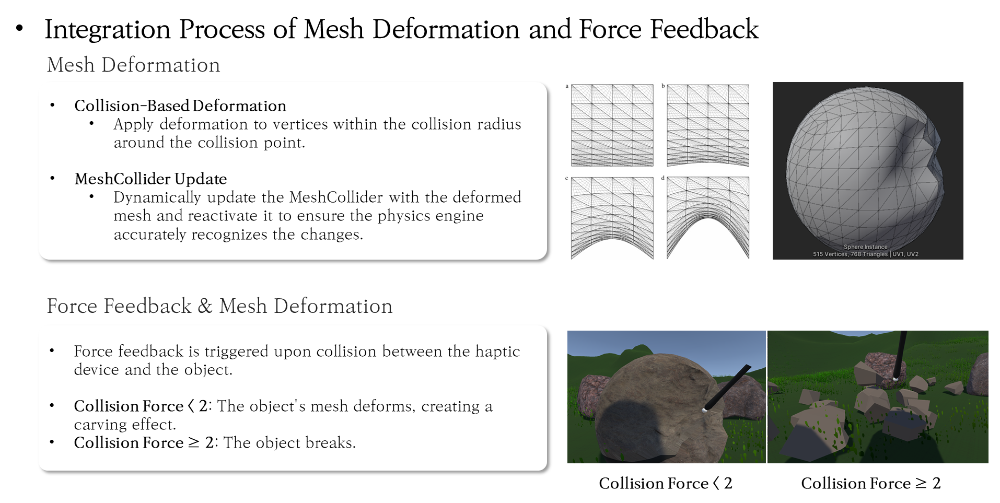
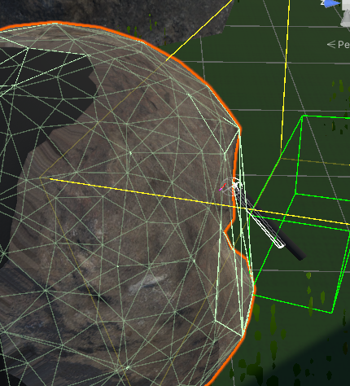
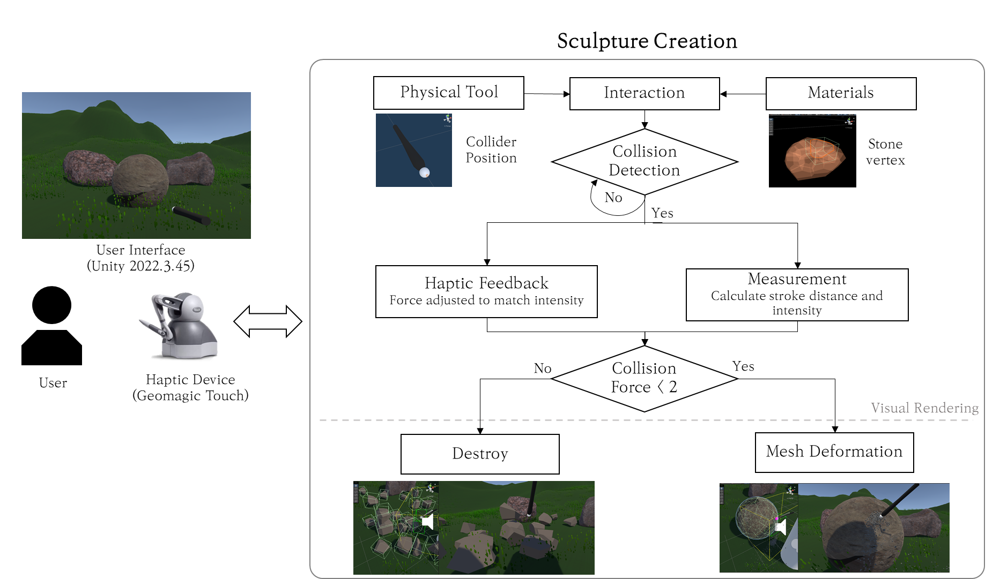
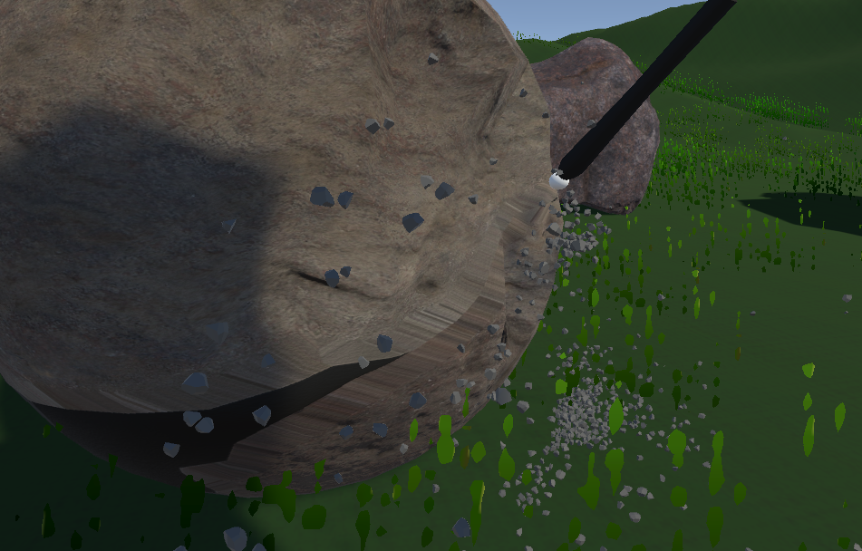

# Haptic_Sculpture
Sculpting with Haptic Feedback(Geomagic Touch)
- `개발 기간`: 2024.11.27 ~ 2034.12.11 (2주)
- `참여 인원` : 1 (1인 프로젝트)
- `사용 언어` : C# (Unity)
- `버전` : Unity 2022.3.45

## Introduction
### Virtual Reality Sculpture Creation with Force Feedback
- Force-based Haptic Rendering
  - Combines physical modeling and real-time feedback to simulate the sensation of sculpting materials Vibration Feedback
- Objective
  - Develop a haptic feedback system for virtual sculpture creation.
 
## Detail

-  Mesh Deformation

### System Flow Chart

## Demo
사진을 누르면 유튜브 동영상 링크로 이동합니다.

